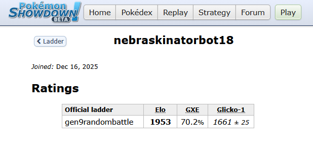
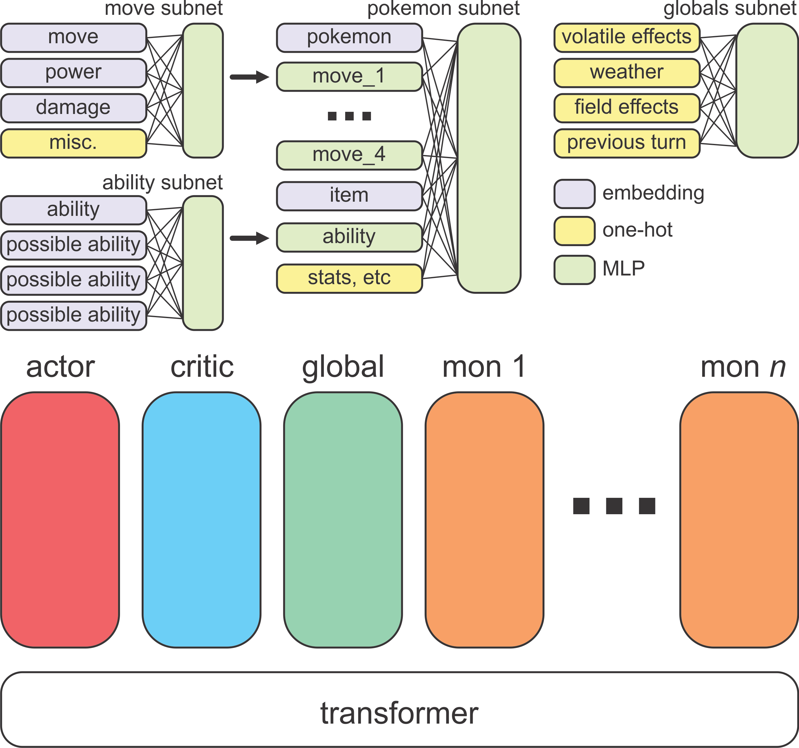

# PokemonTransformer: A Reinforcement Learning Approach for Pokémon Showdown

This repository contains the source code, model architecture, and experimental results for training a pure Reinforcement Learning (RL) agent to play Pokémon Showdown Gen 9 Random Battle.

*Note: This repository serves as an archival record of the methodology and results. It is not packaged as a consumer-facing application or tutorial, but may serve as a reference for future approaches*

---

## Environmental Complexities

From a reinforcement learning perspective, the Pokémon Showdown random battle environment presents a significant challenge:

1. **Simultaneous Action Selection:** Both agents submit their actions concurrently. There is no sequential turn order, requiring policies to approximate Nash Equilibria rather than simple state-action mappings.
2. **Imperfect Information:** The opponent's team composition, movesets, abilities, and exact statistical distributions (EVs/IVs) are obfuscated until revealed during gameplay. The agent must maintain implicit belief states over hidden variables.
3. **High Stochasticity:** The environment features random team composition and move sets, critical hit probabilities, and secondary effect triggers (e.g., accuracy checks or a 10% probability to freeze). Tactically optimal decisions carry non-zero probabilities of failure.

These variables are rarely present simultaneously in traditional RL benchmarks (such as Chess or Go). They are, however, present in many real-world environments, classic games like poker, and in multi-agent auto-battlers like Teamfight Tactics (TFT). To isolate and test algorithmic responses to these specific environmental hurdles with less computational overhead, I have developed a simple version of TFT: [SimpleTFT](https://github.com/Nebraskinator/SimpleTFTEnv).

## Previous Work

A review of the literature regarding Pokémon Showdown AI reveals that the highest-performing algorithms are driven by engine-assisted search. Wang et al., PokéChamp, and Foul Play utilize a tree search assisted by a simulator engine to evaluate actions.

While these publications report high win rates, they require a near-perfect simulation engine to calculate the best moves. There are many environments, including the real-world, where a near-perfect simulation is infeasible. 

Wang et al. trained an MLP using PPO in his work, but ultimately relied on MCTS using a game engine guided by the trained policy evaluate actions. I trained a similar (MLP) architecture using the hyperparameters detailed in Wang's work without the MCTS component to evaluate the network purely as a standalone policy. Under these conditions, the replicated MLP agent plateaued at approximately 1100 ELO. This suggests that the MLP architecture struggled to internalize the tactical depth required by the environment, instead relying heavily on engine-assisted search to compute decision boundaries.

## Architectural Motivation: The Case for Transformers

A Pokémon battle state is not effectively represented as a flattened 1D array of floats. It is a highly structured, relational set of discrete entities. Flattening 12 Pokémon, their discrete moves, and global field effects destroys the semantic geometry of the state space.

Transformers are natively designed to process sets of tokens and model relationships between them. By modeling the game state as a sequence of discrete embeddings (1 Field Token, 12 Pokémon Tokens), the Self-Attention mechanism allows the network to dynamically route tactical information. For example, the model can learn to heavily attend its Active Pokémon's "Move Token" to the opponent's Active "Type Token" to natively calculate type matchups within the latent space.

## Methodology and Results

To address the sparse reward problem and bootstrap the agent's representation of foundational mechanics, training was conducted in two distinct phases:

1. **Behavioral Cloning (Imitation Learning):** An initial dataset was generated using the programmatic heuristic bots provided in the `poke-env` library (specifically `SimpleHeuristicsPlayer`). The Transformer was trained via cross-entropy loss to predict the heuristic actions, establishing a baseline of legal and generally logical play.
2. **Proximal Policy Optimization (PPO):** Following the imitation phase, the model transitioned to distributed self-play using Ray. The agent was trained on >150M states over the course of 2 days on a consumer PC (RTX 3090).

**Results:**
The resulting agent achieved a >85% winrate against the SimpleHeuristicsPlayer and a rating exceeding **1600 ELO on the Generation 9 Random Battle ladder.** To my knowledge, this represents the highest documented performance for a pure neural policy in Pokémon Showdown. During inference, the agent does not utilize MCTS, Expectimax, or external programmatic damage calculators. The raw observation tensor is processed, and the optimal tactical action is sampled from the output distribution in a single forward pass.

## Broader Implications

Achieving highly competitive performance in this environment without tree-search algorithms represents a meaningful data point for applied reinforcement learning. It provides empirical evidence that Attention mechanisms possess the capacity to internalize complex, stochastic, and hidden-information game trees directly into their network weights.

Real-world decision-making environments frequently exhibit simultaneous actions and branching factors that render exhaustive tree search computationally intractable, and complex state evolutions that cannot be simulated. Demonstrating that a pure neural policy can navigate this degree of uncertainty validates the pursuit of Transformer-based RL architectures in complex, real-world deployments.

## Observation Space & State Representation

To effectively feed the state of a Pokémon battle into a neural network, the raw string-based objects returned by the Showdown simulator must be encoded into a structured numerical format. Because the environment operates with highly structured and categorized data, a simple flattened array obscures critical relationships.

Instead, the observation is assembled into a carefully mapped 1D tensor that the neural network later "unpacks" into discrete groups. This allows the model to process distinct logical entities (e.g., individual Pokémon, individual moves, global field states) rather than treating the game state as an undifferentiated stream of floats.

### The Observation Tensor Layout

The agent observes the game as an array of over 3,000 float values. This array is logically partitioned into the following major segments:

| Segment | Dimensionality | Description |
| :--- | :--- | :--- |
| **Pokémon Body** | 12 × 326 | The physical state of all 12 Pokémon (6 allied, 6 opposing). Includes HP, stats, boosts, types, and status conditions. |
| **Pokémon IDs** | 12 × 2 | Categorical indices for the Species and held Item of each Pokémon. |
| **Ability IDs** | 12 × 4 | Categorical indices for potential abilities (to account for hidden/unknown abilities on opponent Pokémon). |
| **Move IDs** | 12 × 4 | Categorical indices for the specific attacks known by each Pokémon. |
| **Move Scalars** | 12 × (4 × 39) | Numerical attributes for each move (Base Power, Accuracy, PP) and categorical one-hot encodings (Type, Physical/Special split, Priority). |
| **Global Scalars** | 62 | Field-wide effects including Turn count, Weather conditions, and Entry Hazards (e.g., Stealth Rock, Spikes). |
| **Transitions** | 12 | Event flags from the previous turn (Who moved first, Critical Hits, Super Effective hits) and the IDs of the moves used. |
| **Action Mask** | 14 | A boolean array defining which of the 14 possible actions are legal on the current turn. |

### Feature Encoding Strategy

To maximize the network's ability to extract meaningful patterns, raw game data is encoded using three primary strategies based on the nature of the information.

#### 1. Identity Embeddings (IDs)
Entities with highly distinct, non-continuous properties—such as a Pokémon's Species, its Ability, or a specific Move—are passed as integer IDs. These IDs are drawn from a pre-computed vocabulary dictionary (`vocab.json`). Inside the neural network, these integers are mapped to learned, high-dimensional embedding vectors, allowing the model to naturally infer that a "Charizard" behaves differently than a "Pikachu."

#### 2. Numerical Bank Embeddings (The Number System)
Instead of passing critical gameplay numbers (like HP percentages, Base Stats, or Move Base Power) as normalized continuous floats, they are cast as discrete integers and passed through shared embedding "Banks".
* **Value_100_Bank:** Used for values naturally scaling from 0 to 100, such as HP percentage, Level, and Move Accuracy.
* **Stat_Bank:** Used for raw base stats (Attack, Speed, etc.), capping at an index of 800.
* **Power_Bank:** Used for move base powers, capping at 251.

#### 3. Multi-Hot and One-Hot Categoricals
Properties that belong to distinct sets but require combinatorial representation are encoded as arrays of flags (0.0 or 1.0).
* **Types:** Because a Pokémon can have up to two types (plus a Tera type), types are encoded as multi-hot vectors.
* **Status Effects:** Conditions like *Burn*, *Paralysis*, or *Toxic* are encoded as one-hot arrays.
* **Volatiles:** Temporary conditions (e.g., *Confusion*, *Leech Seed*, *Protect*) are multi-hot encoded, as multiple can be active simultaneously.

#### 4. Binned Continuous Variables
Instead of passing raw, unbounded integers (like exact HP or raw stat values) directly into the network—which can cause gradient instability—continuous variables are either normalized or binned.
* **Boosts:** Stat modifiers ranging from -6 to +6 are shifted to a positive 0-12 scale and passed as one-hot arrays.
* **Weather Duration:** The remaining turns of weather effects are encoded using a "Two-Hot" binning strategy across 10 bins, preserving the exact duration while maintaining numerical stability.
* **Stacking Hazards:** Conditions like *Spikes* (which can stack up to 3 times) are normalized to a value between 0.0 and 1.0.

### The Action Mask

A critical component of the observation is the Action Mask. The agent is capable of selecting one of 14 discrete actions at any given time:
* **0-3:** Use Move 1 through 4.
* **4-9:** Switch to Pokémon 1 through 6.
* **10-13:** Terastallize and use Move 1 through 4.

## Network Architecture

Flattening a Pokémon battle into a 1D array destroys the relational geometry of the game. A Pokémon is not just a list of numbers; it is a distinct entity that interacts with other distinct entities. To capture this, the agent utilizes a custom Transformer architecture (`PokeTransformer`) that processes the game state as a sequence of distinct tokens, allowing the network to natively learn tactical relationships via Self-Attention.

### Phase 1: Feature Extraction & Tokenization

Before reaching the Transformer, the raw observation tensor is routed through several specialized Multi-Layer Perceptrons (MLPs), acting as "tokenizers" for the game state. These subnetworks fuse the categorical embeddings and binned continuous variables into dense, high-dimensional vectors.

* **Move Subnet:** Fuses a move's categorical ID, base power, accuracy, PP, type, and priority flags into a single `move_vec`.
* **Ability Subnet:** Fuses the categorical ability IDs, including possible abilities, into an `ability_vec`.
* **Pokémon Subnet:** Acts as the primary aggregator. It concatenates a Pokémon's base stats, HP, categorical identity (Species/Item embeddings), active status flags, and its respective `move_vec`s and `ability_vec`s. This outputs **12 distinct Pokémon Tokens** (6 allied, 6 opposing).
* **Field Subnet:** Aggregates global game variables (weather, hazards, turn count) and transition history (who moved first, critical hits on the previous turn) into a single **Field Token**.

### Phase 2: The Sequence and The "Poke-Mask"

The transformer sequence is constructed by concatenating 15 total tokens:
1. **Actor Token (CLS)**
2. **Critic Token (CLS)**
3. **Field Token**
4. **12 × Pokémon Tokens**

To prevent information leakage and force the network into a strict feature-extraction hierarchy, the standard self-attention mechanism is constrained by a custom attention mask (the "Poke-Mask"):
* **State Isolation:** The 13 State Tokens (Field + 12 Pokémon) are completely blind to the Actor and Critic tokens. They can only attend to each other. This forces the transformer backbone to build a pure, objective representation of the tactical state without being biased by the policy or value heads.
* **Head Independence:** The Actor and Critic tokens are blind to each other. The Actor must independently query the state tokens to find the best action, while the Critic must independently query the state tokens to evaluate the win probability.

The full 15-token sequence passes through an $N$-layer `nn.TransformerEncoder` utilizing Pre-Layer Normalization (`norm_first=True`) and GELU activations for training stability.

### Phase 3: Decision Heads

After the sequence exits the main Transformer backbone, the Actor and Critic tokens are routed to their respective linear heads:
* **The Policy Head (`pi_head`):** Takes the Actor token and projects it into 14 dimensions (the Action Logits). These logits are masked using the environment's legal action mask, and the final move is sampled from the resulting categorical distribution.
* **The Value Head (`v_head`):** Takes the Critic token and projects it into a 51-bin categorical distribution. Rather than predicting a single scalar value, the network uses **Distributional RL**, predicting the *probability distribution* of the expected return across a support range of $[-1.6, 1.6]$. The final expected value is the probability-weighted sum of these bins.

*(Schematic of the subnet and transformer architecture used in this study)*
